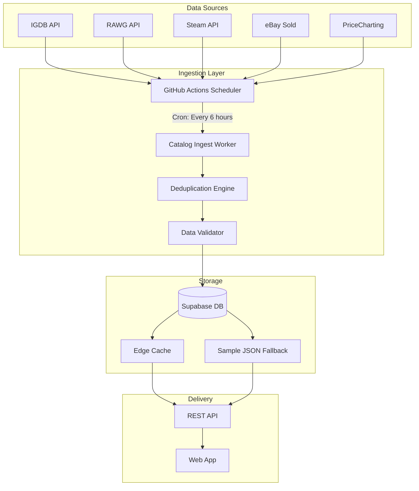

# Universal Games Expansion Roadmap

_Created: December 2025_

> **Mission**: Transform Dragon's Hoard Atlas from a retro-focused catalog into a **universal video game database** covering all platforms, eras, and formats—while maintaining our privacy-first, collector-centric DNA.

## Expansion Overview

### What's Changing

| Before                      | After                                           |
| --------------------------- | ----------------------------------------------- |
| Retro games only (pre-2010) | ALL games (retro, modern, indie, mobile, VR)    |
| ~2,000 titles               | 100,000+ titles (target)                        |
| 15 classic platforms        | 50+ platforms including PC, mobile, VR          |
| Static annual updates       | Continuous ingestion with weekly refresh cycles |
| Single-source pricing       | Multi-source pricing with confidence scores     |

### Platforms to Add

| Category        | Platforms                                                           | Priority |
| --------------- | ------------------------------------------------------------------- | -------- |
| **Current Gen** | PS5, Xbox Series X/S, Nintendo Switch, Steam Deck                   | 🔴 High  |
| **Last Gen**    | PS4, Xbox One, Wii U, 3DS, Vita                                     | 🔴 High  |
| **PC**          | Steam, Epic, GOG, Battle.net, EA App                                | 🔴 High  |
| **Mobile**      | iOS, Android (premium games focus)                                  | 🟡 Med   |
| **VR**          | Quest, PSVR2, SteamVR                                               | 🟡 Med   |
| **Indie**       | itch.io notable releases, Game Pass additions                       | 🟡 Med   |
| **Retro**       | Already covered (NES through PS3/360/Wii era)                       | ✅ Done  |
| **Arcade**      | Arcade1Up, MAME-documented cabinets                                 | 🟢 Low   |
| **Emerging**    | Cloud gaming exclusives (Luna, GeForce NOW originals), Apple Arcade | 🟢 Low   |

---

## Data Ingestion Strategy

### Primary Data Sources

| Source            | Coverage                    | Update Frequency | Integration Status |
| ----------------- | --------------------------- | ---------------- | ------------------ |
| **IGDB**          | 200k+ games, all platforms  | Real-time API    | ✅ Integrated      |
| **RAWG**          | 500k+ games, broad coverage | Daily API        | ✅ Integrated      |
| **GiantBomb**     | Deep metadata, wiki-quality | Weekly           | 📋 Planned         |
| **MobyGames**     | Historical accuracy         | Weekly           | 📋 Planned         |
| **Steam API**     | PC games, pricing           | Daily            | 📋 Planned         |
| **PriceCharting** | Physical game pricing       | Daily            | ✅ Integrated      |
| **eBay Sold**     | Real market prices          | Daily            | ✅ Integrated      |
| **OpenCritic**    | Modern game reviews         | Daily            | 📋 Planned         |
| **HowLongToBeat** | Completion times            | Weekly           | 📋 Planned         |

### Continuous Update Pipeline



### Update Cadences

| Data Type            | Frequency   | Trigger                              |
| -------------------- | ----------- | ------------------------------------ |
| New releases         | Daily       | IGDB webhook + scheduled scan        |
| Price updates        | Every 6 hrs | GitHub Actions cron                  |
| Cover art            | On-demand   | Missing cover audit + nightly batch  |
| Metadata enrichment  | Weekly      | Sunday batch job                     |
| Full catalog refresh | Monthly     | First Sunday of month                |
| Platform additions   | Quarterly   | Manual curation + community requests |

---

## Implementation Phases

### Phase 5A: Modern Platforms (Q1 2025) ✅ COMPLETE

**Goal**: Add current-gen and last-gen console games

**Status**: ✅ COMPLETE (December 2025) - **74,458 games** ingested from 13 platforms

**Tasks**:

- [x] IGDB API integration with OAuth (`services/catalog-ingest/sources/igdb.js`)
- [x] Platform mapping (IGDB IDs → internal platform names)
- [x] Create "era" filter (Retro/Last-Gen/Current-Gen) with Indie/VR toggles
- [x] Platform import from Steam, Xbox, PlayStation, and 10+ services
- [x] Add PS5, Xbox Series X/S, Switch game catalogs (74,458 games from IGDB)
- [x] Add PS4, Xbox One backlog (included in IGDB ingestion)
- [ ] Upload catalog to Supabase for production
- [ ] Update UI platform badges for modern consoles
- [ ] Test virtualization with 50k+ games

**Exit Criteria**: ~~25,000+ modern games in catalog with working filters~~ **EXCEEDED: 74,458 games**

### Phase 5B: PC Gaming (Q1-Q2 2025)

**Goal**: Comprehensive PC game coverage

**Tasks**:

- [ ] Steam API integration for catalog + pricing
- [ ] GOG database integration
- [ ] Epic Games store notable releases
- [ ] PC-specific metadata (system requirements, launcher)
- [ ] Steam Deck verified badge display
- [ ] Price comparison across storefronts

**Exit Criteria**: 100,000+ PC games with storefront links

### Phase 5C: Indie & Digital (Q2 2025)

**Goal**: Cover the long tail of indie games

**Tasks**:

- [ ] itch.io notable releases integration
- [ ] Game Pass catalog tracking
- [ ] PS Plus catalog tracking
- [ ] "Indie spotlight" featured section
- [ ] Release date tracking for upcoming games

**Exit Criteria**: 150,000+ total games

### Phase 5D: Mobile & VR (Q2-Q3 2025)

**Goal**: Expand to emerging platforms

**Tasks**:

- [ ] Premium mobile games (Apple Arcade, paid Android)
- [ ] Meta Quest store integration
- [ ] PSVR2 catalog
- [ ] SteamVR notable titles
- [ ] Platform-specific filters and badges

**Exit Criteria**: VR and mobile sections with 5,000+ titles

### Phase 5E: Continuous Data Pipeline (Ongoing)

**Goal**: Fully automated, self-maintaining data freshness

**Tasks**:

- [ ] GitHub Actions scheduled jobs for all sources
- [ ] Webhook receivers for real-time IGDB updates
- [ ] Data quality monitoring dashboard
- [ ] Automated anomaly detection (sudden drops, duplicates)
- [ ] Community correction workflow
- [ ] Weekly data health reports

**Exit Criteria**: <24hr lag for new releases, 99.5% uptime

---

## Database Schema Additions

### New Platform Types

```sql
-- Add to platforms enum or table
INSERT INTO platforms (code, name, era, generation) VALUES
  ('ps5', 'PlayStation 5', 'current', 9),
  ('xsx', 'Xbox Series X/S', 'current', 9),
  ('switch', 'Nintendo Switch', 'current', 9),
  ('steam', 'Steam (PC)', 'current', null),
  ('quest', 'Meta Quest', 'current', null),
  ('ios', 'iOS', 'current', null),
  ('android', 'Android', 'current', null);
```

### New Metadata Fields

```sql
ALTER TABLE games ADD COLUMN IF NOT EXISTS
  igdb_id INTEGER UNIQUE,
  rawg_id INTEGER,
  steam_appid INTEGER,
  is_indie BOOLEAN DEFAULT false,
  is_vr_supported BOOLEAN DEFAULT false,
  pc_requirements JSONB,
  storefronts JSONB, -- [{name: 'Steam', url: '...', price: 2999}]
  release_status TEXT CHECK (release_status IN ('released', 'early_access', 'upcoming', 'cancelled'));
```

---

## API Rate Limit Management

| API           | Limit            | Strategy                               |
| ------------- | ---------------- | -------------------------------------- |
| IGDB          | 4 req/sec        | Request queue with 250ms delay         |
| RAWG          | 20k/month (free) | Prioritize missing data, cache heavily |
| Steam         | 100k/day         | Batch requests, 24hr cache             |
| MobyGames     | 360/hour         | Off-peak scheduling (3-6 AM UTC)       |
| PriceCharting | Unlimited (paid) | Real-time for popular, daily for rest  |

---

## Quality Assurance

### Data Validation Rules

1. **Game Name**: Required, 1-200 characters
2. **Platform**: Must match known platform enum
3. **Release Year**: 1958-2030 (validate against actual releases)
4. **Cover URL**: Must resolve (HTTP 200), prefer HTTPS
5. **Rating**: 0.0-10.0 scale, normalize from sources
6. **Description**: Max 2000 chars, strip HTML

### Deduplication Strategy

1. **Primary Key**: Normalize `game_name` + `platform`
2. **Fuzzy Match**: Levenshtein distance < 0.15 for similar names
3. **IGDB ID**: Use as source of truth when available
4. **Conflict Resolution**: Prefer IGDB > RAWG > MobyGames > Community

### Monitoring

- **Data freshness dashboard**: Time since last update per source
- **Coverage metrics**: % games with description, cover, rating
- **Error rates**: Failed API calls, validation failures
- **Community reports**: Track and prioritize user-flagged issues

---

## Migration Checklist

### Completed ✅

- [x] Update index.html meta tags (retro → video games)
- [x] Update package.json description and keywords
- [x] Update manifest.json description
- [x] Update settings modal description
- [x] Update main.ts header comment
- [x] Update share message text
- [x] Update guides.ts author name
- [x] Update copilot-instructions.md overview
- [x] Update data-sources.md header
- [x] Update README.md project description

### In Progress 🚧

- [x] IGDB API integration script (`services/catalog-ingest/sources/igdb.js`)
- [ ] Modern platform catalog seeding (requires IGDB credentials in secrets)
- [ ] Platform filter UI expansion

### Planned 📋

- [ ] Steam API integration
- [ ] Update all guide markdown files (author attribution)
- [ ] Create modern platform collecting guides
- [ ] Update outreach plan for broader gaming community
- [ ] GitHub Pages URL migration (if renaming repo)

---

## Community Engagement

### Expanded Audience

| Segment                    | Size  | Outreach Strategy                            |
| -------------------------- | ----- | -------------------------------------------- |
| Retro collectors           | 500k+ | Existing audience, maintain core features    |
| Trophy/achievement hunters | 2M+   | Add completion tracking, link to PSNProfiles |
| Steam collectors           | 5M+   | Steam library import, showcase value         |
| Backlog managers           | 10M+  | Integrate with Backloggd, HLTB               |
| Deal hunters               | 20M+  | Price alerts, historical lows                |

### New Content Types

- Modern game collecting guides (limited editions, steelbooks)
- Platform comparison guides (where to play)
- Digital vs physical value analysis
- Game Pass/PS Plus tracking and value calculators
- Upcoming releases calendar

---

## Success Metrics

| Metric                     | Current | 6-Month Target | 12-Month Target |
| -------------------------- | ------- | -------------- | --------------- |
| Total games in catalog     | ~2,000  | 100,000        | 250,000         |
| Platforms supported        | 15      | 35             | 50+             |
| Daily active users         | TBD     | 1,000          | 10,000          |
| Data freshness (new games) | N/A     | <48 hrs        | <24 hrs         |
| Cover art coverage         | 98.7%   | 95%            | 97%             |
| API uptime                 | N/A     | 99%            | 99.9%           |

---

## Next Steps (Immediate Actions)

1. **Register for IGDB API access** via Twitch Developer Console (get `IGDB_CLIENT_ID` and `IGDB_CLIENT_SECRET`)
2. ~~**Create IGDB adapter**~~ ✅ Done: `services/catalog-ingest/sources/igdb.js`
3. **Run initial IGDB catalog pull**: `npm run ingest:catalog` with credentials
4. **Add modern platforms to UI** (PS5, Switch, Xbox Series X filter options)
5. **Set up GitHub Actions** scheduled workflow for daily updates
6. **Expand sample-games.json** to include modern game examples
7. **Create data health monitoring** dashboard in Supabase

---

_This document should be updated as phases complete. See [implementation-plan.md](./implementation-plan.md) for detailed task breakdowns._
