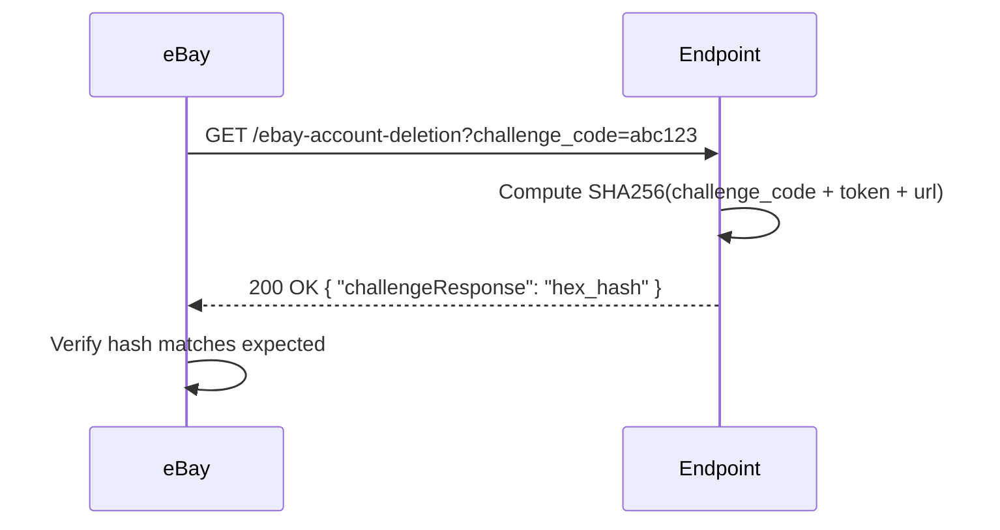
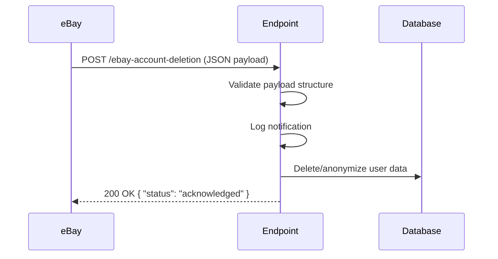

# eBay Marketplace Account Deletion Notifications

This document describes the eBay Marketplace Account Deletion/Closure notification endpoint implemented as a Supabase Edge Function. This endpoint is required for GDPR/CCPA compliance when integrating with eBay's marketplace APIs.

## Overview

When a user deletes their eBay account, eBay sends a notification to registered endpoints so that marketplace integrations can delete or anonymize user data. This endpoint handles:

1. **GET requests** - Endpoint verification via challenge/response
2. **POST requests** - Account deletion/closure notifications

## Environment Variables

| Variable                              | Required | Description                                    | Example                                                               |
| ------------------------------------- | -------- | ---------------------------------------------- | --------------------------------------------------------------------- |
| `EBAY_MARKETPLACE_VERIFICATION_TOKEN` | Yes      | Secret token you create and register with eBay | `my-secret-token-abc123`                                              |
| `EBAY_MARKETPLACE_ENDPOINT_URL`       | Yes      | The public HTTPS URL eBay will call            | `https://your-project.supabase.co/functions/v1/ebay-account-deletion` |
| `SUPABASE_URL`                        | No       | Auto-injected by Supabase                      | -                                                                     |
| `SUPABASE_SERVICE_ROLE_KEY`           | No       | Required if implementing database deletions    | -                                                                     |

### Setting Environment Variables

#### For Supabase Edge Functions

```bash
# Set secrets for the Edge Function
supabase secrets set EBAY_MARKETPLACE_VERIFICATION_TOKEN=your-token-here
supabase secrets set EBAY_MARKETPLACE_ENDPOINT_URL=https://your-project.supabase.co/functions/v1/ebay-account-deletion
```

#### For Local Development

Add to your `.env` file:

```bash
EBAY_MARKETPLACE_VERIFICATION_TOKEN=your-verification-token
EBAY_MARKETPLACE_ENDPOINT_URL=https://your-project.supabase.co/functions/v1/ebay-account-deletion
```

## Deriving the Endpoint URL

Your endpoint URL follows this pattern:

```
https://<PROJECT_REF>.supabase.co/functions/v1/ebay-account-deletion
```

Where `<PROJECT_REF>` is your Supabase project reference (e.g., `vssbtwhvdwabbbnrgmde`).

To find your project reference:

1. Go to your Supabase dashboard
2. Navigate to Settings → General
3. Copy the "Reference ID"

**Full URL example:**

```
https://vssbtwhvdwabbbnrgmde.supabase.co/functions/v1/ebay-account-deletion
```

## eBay Developer Portal Configuration

### Step-by-Step Setup

1. **Log in to the eBay Developer Portal**
   - Go to [developer.ebay.com](https://developer.ebay.com)
   - Sign in with your developer account

2. **Navigate to Alerts & Notifications**
   - Go to your application's settings
   - Find "Alerts & Notifications" or "Marketplace Account Deletion"

3. **Register the Endpoint**
   - **Notification Endpoint**: Paste your full endpoint URL
     ```
     https://your-project.supabase.co/functions/v1/ebay-account-deletion
     ```
   - **Verification Token**: Enter the same token you set in `EBAY_MARKETPLACE_VERIFICATION_TOKEN`

4. **Verify the Endpoint**
   - Click "Save" or "Verify"
   - eBay will send a GET request with a `challenge_code` parameter
   - The endpoint will respond with the computed hash
   - If successful, the endpoint is registered

5. **Enable Notifications**
   - Once verified, enable the "Marketplace Account Deletion" notification type

## How It Works

### Verification Flow (GET)



### Deletion Notification Flow (POST)



## Testing

### Test GET Challenge (Verification)

```bash
# Replace with your actual values
ENDPOINT_URL="https://your-project.supabase.co/functions/v1/ebay-account-deletion"
CHALLENGE_CODE="test-challenge-123"

curl -X GET "${ENDPOINT_URL}?challenge_code=${CHALLENGE_CODE}"
```

Expected response:

```json
{
  "challengeResponse": "a1b2c3d4e5f6...64_character_hex_hash..."
}
```

### Test POST Deletion Notification

```bash
ENDPOINT_URL="https://your-project.supabase.co/functions/v1/ebay-account-deletion"

curl -X POST "${ENDPOINT_URL}" \
  -H "Content-Type: application/json" \
  -d '{
    "metadata": {
      "topic": "MARKETPLACE_ACCOUNT_DELETION",
      "schemaVersion": "1.0"
    },
    "notification": {
      "notificationId": "test-notification-id",
      "eventDate": "2025-12-11T10:30:00.000Z",
      "publishDate": "2025-12-11T10:30:05.000Z",
      "publishAttemptCount": 1,
      "data": {
        "username": "testuser123",
        "userId": "TESTUSER12345",
        "eiasToken": "nY+sHZ2PrBmdj6wVnY+sEZ2PrA2dj6wFk4GhDJOCpQSdj6x9nY+seQ=="
      }
    }
  }'
```

Expected response:

```json
{
  "status": "acknowledged",
  "notificationId": "test-notification-id",
  "message": "Deletion request acknowledged for eBay user TESTUSER12345"
}
```

### Test Error Handling

```bash
# Test malformed JSON
curl -X POST "${ENDPOINT_URL}" \
  -H "Content-Type: application/json" \
  -d 'not valid json'

# Expected: 400 Bad Request with { "error": "Invalid JSON body" }

# Test missing required fields
curl -X POST "${ENDPOINT_URL}" \
  -H "Content-Type: application/json" \
  -d '{"metadata": {}}'

# Expected: 400 Bad Request with { "error": "Invalid payload structure" }
```

## Deploying the Edge Function

### Initial Deployment

```bash
# From the project root
supabase functions deploy ebay-account-deletion --no-verify-jwt
```

The `--no-verify-jwt` flag is required because eBay doesn't send Supabase JWT tokens.

### Verify Deployment

```bash
# Check function status
supabase functions list
```

## Implementing Data Deletion

The current implementation logs deletion requests but does not perform actual data deletion. To implement full GDPR/CCPA compliance:

1. **Identify user data**: Determine what data you store linked to eBay users
2. **Implement deletion logic**: Modify the `handleAccountDeletion()` function in `supabase/functions/ebay-account-deletion/index.ts`
3. **Consider anonymization**: For audit trails, anonymize rather than delete

### Example Implementation

```typescript
async function handleAccountDeletion(
  userId: string,
  username: string,
  eiasToken: string
): Promise<{ success: boolean; message: string }> {
  const supabase = createClient(supabaseUrl, serviceKey);

  // Delete user's price alerts
  await supabase.from("user_price_alerts").delete().eq("ebay_user_id", userId);

  // Anonymize transaction history
  await supabase
    .from("ebay_transactions")
    .update({
      ebay_username: "[deleted]",
      ebay_user_id: "[deleted]",
    })
    .eq("ebay_user_id", userId);

  // Delete session data
  await supabase.from("ebay_sessions").delete().eq("ebay_user_id", userId);

  return {
    success: true,
    message: `Deleted data for eBay user ${userId}`,
  };
}
```

## Monitoring & Logging

The endpoint logs all notifications in structured JSON format:

```json
{
  "timestamp": "2025-12-11T10:30:00.000Z",
  "service": "ebay-account-deletion",
  "type": "received",
  "notificationId": "abc123",
  "userId": "TESTUSER12345",
  "username": "testuser123",
  "topic": "MARKETPLACE_ACCOUNT_DELETION",
  "eventDate": "2025-12-11T10:30:00.000Z"
}
```

View logs in Supabase:

1. Go to your Supabase dashboard
2. Navigate to Edge Functions → ebay-account-deletion → Logs

Or via CLI:

```bash
supabase functions logs ebay-account-deletion
```

## Troubleshooting

### Verification Fails

1. **Check environment variables are set:**

   ```bash
   supabase secrets list
   ```

2. **Verify URL matches exactly** - The URL you enter in eBay must match `EBAY_MARKETPLACE_ENDPOINT_URL` character-for-character

3. **Check function is deployed:**
   ```bash
   supabase functions list
   ```

### POST Returns 500

1. Check Supabase function logs for errors
2. Verify `SUPABASE_SERVICE_ROLE_KEY` is set if using database operations
3. Ensure database tables exist

### CORS Errors

The endpoint includes CORS headers. If you're testing from a browser, ensure you're making the request from an allowed origin or use `curl` instead.

## Security Considerations

1. **Keep tokens secret** - Never commit `EBAY_MARKETPLACE_VERIFICATION_TOKEN` to version control
2. **Use HTTPS only** - eBay requires HTTPS endpoints
3. **Validate payloads** - The endpoint validates all incoming payloads
4. **Log for audit** - All notifications are logged for compliance auditing
5. **Rate limiting** - Consider adding rate limiting if you receive high volumes

## References

- [eBay Marketplace Account Deletion Documentation](https://developer.ebay.com/marketplace-account-deletion)
- [Supabase Edge Functions](https://supabase.com/docs/guides/functions)
- [GDPR Right to Erasure](https://gdpr-info.eu/art-17-gdpr/)
